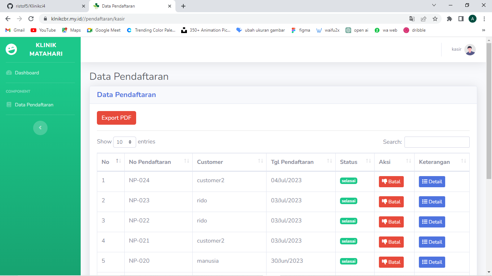
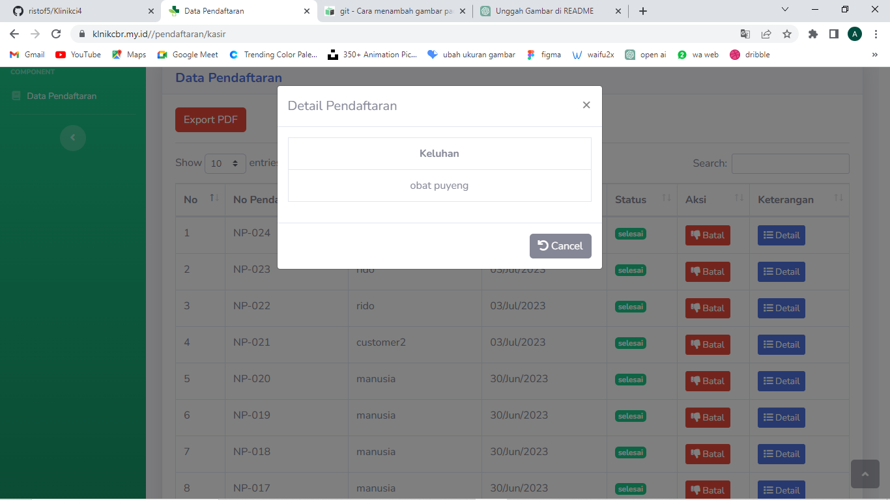
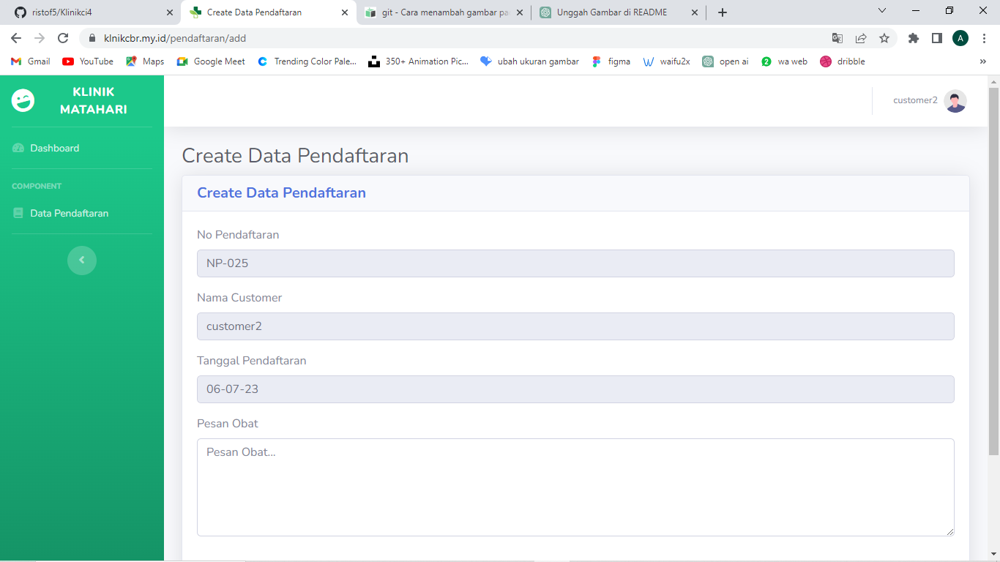

# Klinik with CodeIgniter

Website Klinik yang dibuat untuk memenuhi tugas akhir mata kuliah pemrograman web 2

## Anggota Kelompok

Nama Kelompok:

1. Fauzhan Qhof Pratama (312110484)
2. Sidik Riffani (312110467)
3. Arya Syah Ramadan (312110149)
4. Rima Puji Lestari (312110517)
5. Muhammad Fajar Setiyanto (312110194)
6. Irgi Jaelani (312110618)

## ERD

## Link Design

https://www.figma.com/file/ScRG1cRxpTuxvnHAt3KDQB/Poster---2?type=design&node-id=0%3A1&mode=design&t=qm0a0HahbnCgukwP-1

## Link Domain

https://klnikcbr.my.id/

## Video Demo aplikasi
yang pertama
https://youtu.be/1JmNfL_jDiI
yang kedua
https://youtu.be/tobWRyJKwQI
## Tahapan Pembuatan

### 1. Membuat Database

Database yang dibuat bernama db_klinik yang terdiri dari beberapa table yang digunakan dalam program

### 2. Download Framework Codeigniter 4

Mendownloadnya bisa melalui web resmi atau via composer
Setelah mendownloadnya simpan file di folder htdocs lalu sesuaikan namanya

### 3. Membuat controller

membuat controller berfungsi untuk mengkontrol fungsi dan database yang digunakan serta membuat fungsi antar penghubung dengan fungsi lain . sesuaikan saja dengan repository

### 4. Membuat Model

model berperan penuh mengatur database yang digunakan.sesuaikan saja dengan repository

### 5. Membuat Views

Membuat view atau tampilan web dimata pengguna.sesuaikan saja dengan repository

### 6. Membuat Routes

Routes merupakan rute yang digunakan setiap fungsi.sesuaikan saja dengan repository

### 7. Tampilan utama

### 8. Tampilan halaman kasir

### 9. Tampilan detail pendaftaran

### 10. Tampilan halaman customer

